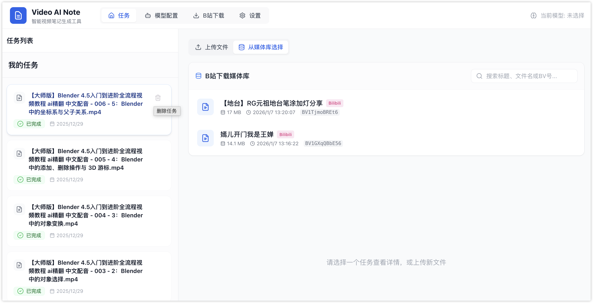
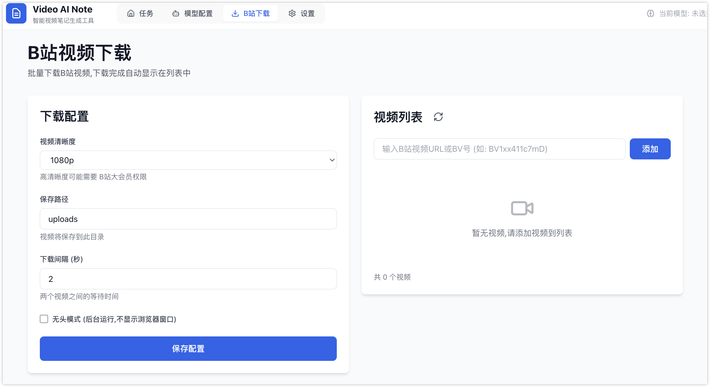

# Video Note AI / AInote

Video Note AI 是一个本地运行的视频笔记应用。它可以上传本地视频、下载网页视频、提取音频、转写语音，并调用你在 App 里配置的 AI 模型生成结构化笔记。

当前版本同时提供桌面 App 和 Chrome/Edge 浏览器插件。插件只负责检测网页视频、选择视频框和清晰度、发起任务；下载、合并、转写、截图、模型调用和笔记生成全部在本机 AInote App 里完成。




## 主要功能

- 本地视频笔记：上传视频后自动提取音频、转写文字，并生成 AI 笔记。
- 网页视频笔记：Chrome/Edge 插件检测当前页面视频，选择清晰度后交给本机 App 下载和生成笔记。
- 视频框选择器：插件支持点击“选视频”，在页面上手动框选目标视频区域，适合多视频或复杂页面。
- 真实清晰度解析：后端使用 `yt-dlp` 解析页面 URL、HLS、DASH 和直接媒体 URL，插件展示后端返回的真实格式。
- 笔记模式选择：插件可选择简洁、详细、学术、创意四种笔记模式，模型和提示词细节仍由 App 端配置管理。
- 语音识别配置：App 端保留本地 `faster-whisper` 转写设置，支持模型、设备、精度等参数配置。
- AI 模型配置：支持 OpenAI 兼容 API 的模型提供商配置，适配 OpenAI、DeepSeek、通义、硅基流动、LM Studio、Ollama 等兼容服务。
- B 站下载：保留原有 Bilibili 下载和任务管理能力。
- 桌面打包：提供 Windows 和 macOS 打包脚本，桌面端通过 `127.0.0.1:8483` 对插件提供本机桥接服务。

## 技术架构

- 后端：FastAPI、SQLite、SQLAlchemy、yt-dlp、ffmpeg、faster-whisper。
- 前端：React、TypeScript、Vite、Zustand、lucide-react。
- 桌面端：pywebview + PyInstaller，内置前端静态资源和 FastAPI 服务。
- 浏览器插件：Chrome/Edge Manifest V3，content script + background service worker + popup。
- 本机桥接：插件访问 `http://127.0.0.1:8483/api/extension/*`，通过本机 bridge token 保护导入接口。

## 快速开始

### 环境要求

- Python 3.10+
- Node.js 18+
- FFmpeg
- Chrome 或 Edge
- Windows 10/11 或 macOS 12+

### 启动后端

```powershell
cd backend
python -m venv venv
.\venv\Scripts\Activate.ps1
pip install -r requirements.txt
playwright install chromium
python main.py
```

macOS/Linux:

```bash
cd backend
python3 -m venv venv
source venv/bin/activate
pip install -r requirements.txt
playwright install chromium
python main.py
```

后端默认监听 `http://127.0.0.1:8483`。

### 启动前端

```powershell
cd frontend
npm install
npm run dev
```

开发模式前端通常运行在 `http://127.0.0.1:5173` 或 Vite 输出的端口。

### 加载浏览器插件

1. 先启动 AInote App 或后端服务。
2. 打开 Chrome/Edge 的扩展管理页：`chrome://extensions` 或 `edge://extensions`。
3. 开启“开发者模式”。
4. 点击“加载已解压的扩展程序”，选择仓库里的 `extension/` 目录。
5. 打开一个视频页面，点击插件图标。
6. 可点击“选视频”手动选择页面中的视频框。
7. 选择候选视频、清晰度、笔记模式，点击“生成视频笔记”。

插件会把任务交给本机 App。任务进入 App 后，下载、转写、截图、模型调用和笔记生成都在 App 端继续执行。

## 桌面 App 打包

### Windows

```powershell
.\scripts\build-windows.ps1
```

常用快速重打包：

```powershell
.\scripts\build-windows.ps1 -SkipFrontend -SkipPlaywright
```

产物：

- `backend/dist/VideoNoteAI/VideoNoteAI.exe`
- `backend/dist/VideoNoteAI-win.zip`

### macOS

```bash
bash ./scripts/build-macos.sh
```

产物：

- `backend/dist/VideoNoteAI.app`
- `backend/dist/VideoNoteAI.dmg`，当系统可用 `hdiutil` 且未设置 `SKIP_DMG=1` 时生成。

可选环境变量：

- `SKIP_FRONTEND=1`：复用现有 `frontend/dist`。
- `SKIP_PLAYWRIGHT=1`：跳过构建期 Chromium 安装。
- `SKIP_DMG=1`：只生成 `.app`。
- `CODESIGN_IDENTITY`、`APPLE_ID`、`APPLE_TEAM_ID`、`APPLE_APP_PASSWORD`：用于签名和 notarization。

更多说明见 `scripts/README.md` 和 `docs/release-checklist.md`。

## 插件 API

插件只访问本机 App 的扩展接口：

- `GET /api/extension/health`：检测 AInote 是否运行，返回 bridge token 和数据目录信息。
- `POST /api/extension/videos/resolve`：解析当前页面和插件嗅探到的视频候选，返回可选格式。
- `POST /api/extension/videos/import`：按用户选择的候选和格式创建下载/笔记任务。
- `GET /api/extension/jobs/{jobId}`：查询插件导入任务进度。

安全约束：

- 下载和笔记生成只在本机 App 执行。
- 插件导入接口需要 bridge token。
- cookies 只有在用户勾选插件里的站点 cookies 选项后才会发送给本机 App。
- cookies、token 和下载临时文件不应提交到 Git 仓库。

## 测试

后端：

```powershell
python -m unittest discover backend\tests
python -m compileall backend\app
```

前端：

```powershell
cd frontend
npm run build
```

插件：

```powershell
node extension\test-popup.js
node extension\test-content-picker.js
node --check extension\background.js
node --check extension\content.js
node --check extension\popup.js
```

Windows E2E：

```powershell
.\scripts\test-windows-extension-api-e2e.ps1
.\scripts\test-windows-extension-hls-e2e.ps1
```

发布前建议按 `docs/release-checklist.md` 完成 Windows、macOS、插件和端到端验证。

## 限制说明

- 不绕过 DRM、EME 加密、付费墙、验证码或站点访问规则。
- 私有或登录态视频可能需要用户在插件中手动允许发送当前站点 cookies。
- 过期签名 URL、跨域限制、站点热链保护和网络中断可能导致下载失败。
- macOS 正式分发需要 Apple Developer 账号完成签名和 notarization。

## 版本

当前发布版本：`v1.1.0`

本版本重点：

- 新增 Chrome/Edge 浏览器视频桥接插件。
- 新增网页视频解析、下载、导入和任务进度同步。
- 新增插件视频框选择器、清晰度选择和笔记模式选择。
- 新增 App 端模型提供商配置与语音识别设置。
- 新增 Windows/macOS 桌面打包脚本和发布检查清单。
