# Video AI Note 技术原理详解

## 项目概述

Video AI Note 是一个智能视频笔记生成工具，能够自动提取视频音频、转写文字，并使用 AI 生成结构化的 Markdown 笔记。项目采用完全本地化处理，保护数据隐私，支持 Ollama 等本地大模型，无需联网即可使用。

## 系统架构

### 整体架构图

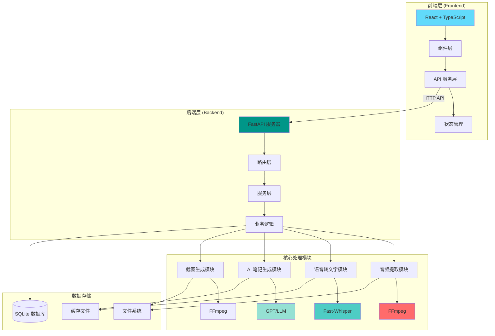

## 核心工作流程

### 完整处理流程

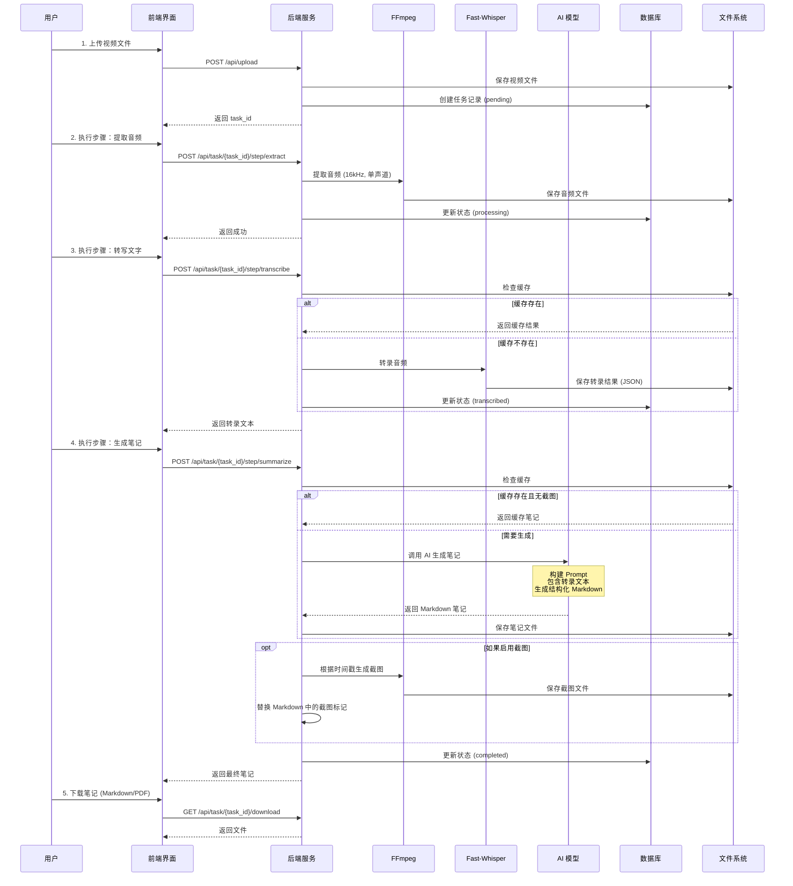

## 技术模块详解

### 1. 音频提取模块

音频提取使用 FFmpeg 从视频文件中提取音频流，并转换为适合语音识别处理的格式。

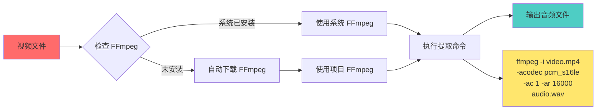

**技术细节：**
- **采样率**：16kHz（Whisper 模型推荐）
- **声道**：单声道（减少计算量）
- **编码格式**：PCM 16-bit（无损，适合语音识别）
- **自动管理**：使用 `imageio-ffmpeg` 自动下载和管理 FFmpeg 二进制文件

### 2. 语音转文字模块

使用 Fast-Whisper（基于 CTranslate2 的 Whisper 实现）进行语音识别，相比原始 Whisper 速度提升 4-5 倍。

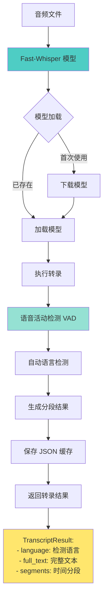

**技术细节：**
- **模型选择**：支持 tiny/base/small/medium/large（默认 base）
- **VAD 过滤**：启用语音活动检测，过滤静音段
- **语言检测**：自动检测音频语言
- **分段输出**：保留时间戳信息，便于后续处理
- **缓存机制**：转录结果保存为 JSON，避免重复处理

### 3. AI 笔记生成模块

使用大语言模型（LLM）将转录文本转换为结构化的 Markdown 笔记。

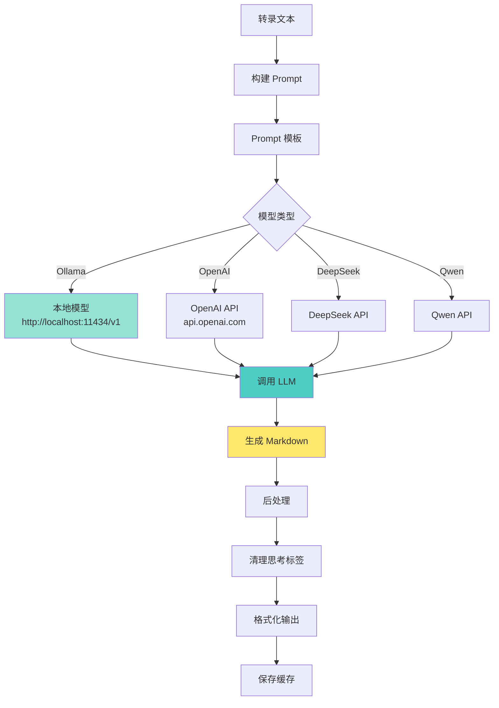

**Prompt 构建策略：**

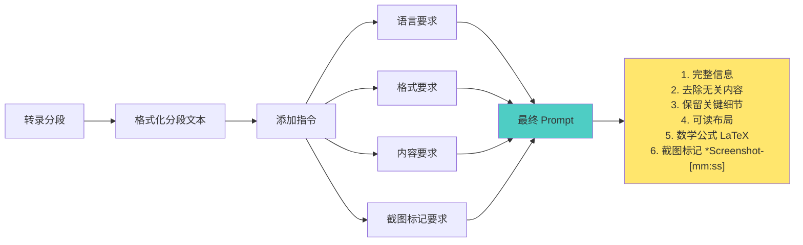

**支持的模型提供商：**
- **Ollama**：本地运行，完全离线，无需 API 密钥
- **OpenAI**：GPT-3.5/GPT-4 系列
- **DeepSeek**：国产大模型
- **Qwen**：阿里通义千问
- **其他 OpenAI 兼容 API**：通过 base_url 配置

### 4. 截图生成模块

根据 Markdown 中的截图标记，从视频中提取对应时间点的帧。

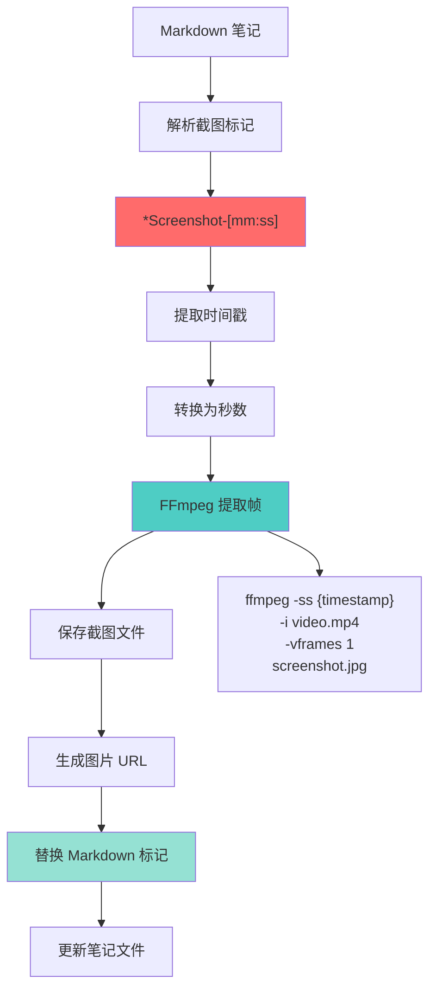

**截图标记格式：**
- 标记格式：`*Screenshot-[mm:ss]`（例如：`*Screenshot-[01:23]`）
- 插入位置：章节内容之后，空行分隔
- 自动替换：生成截图后，标记被替换为 ``

## 数据流与状态管理

### 任务状态流转

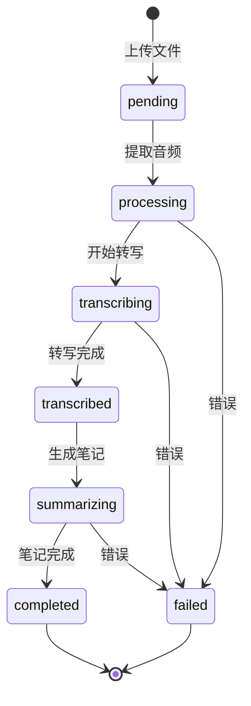

### 数据存储结构

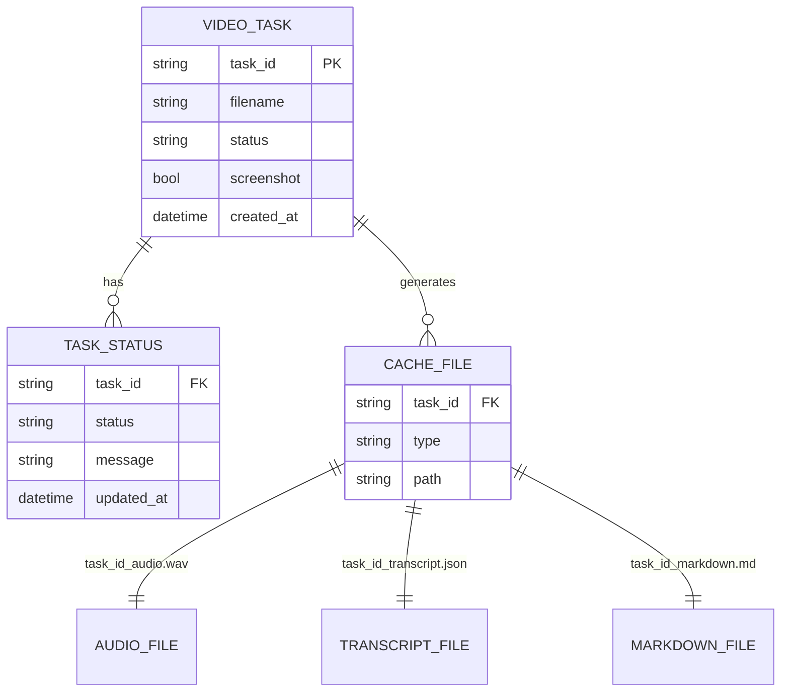

## 前端架构

### 组件层次结构

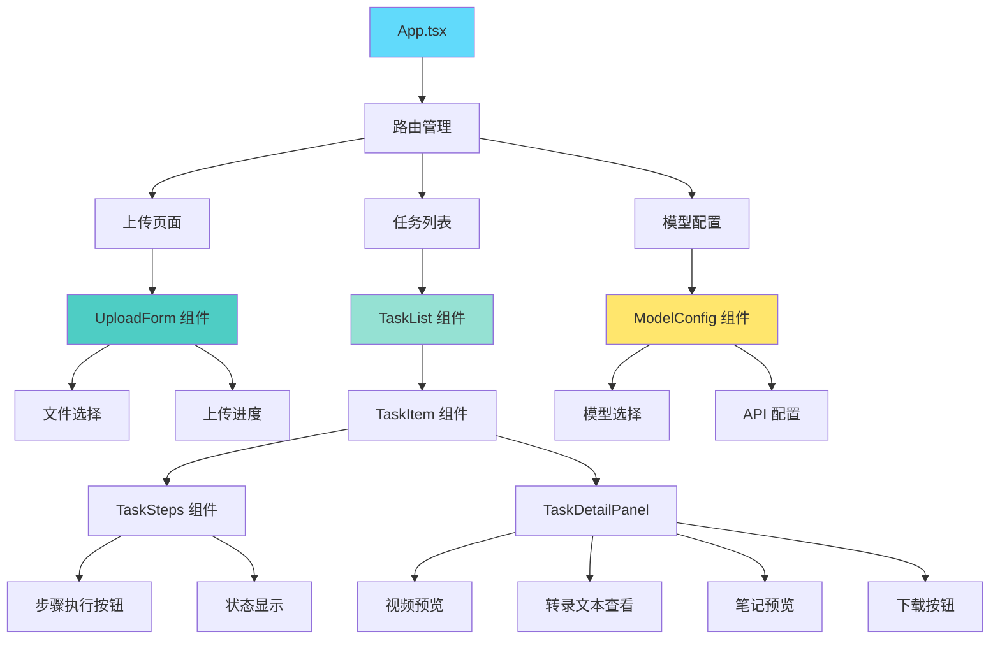

### 状态管理

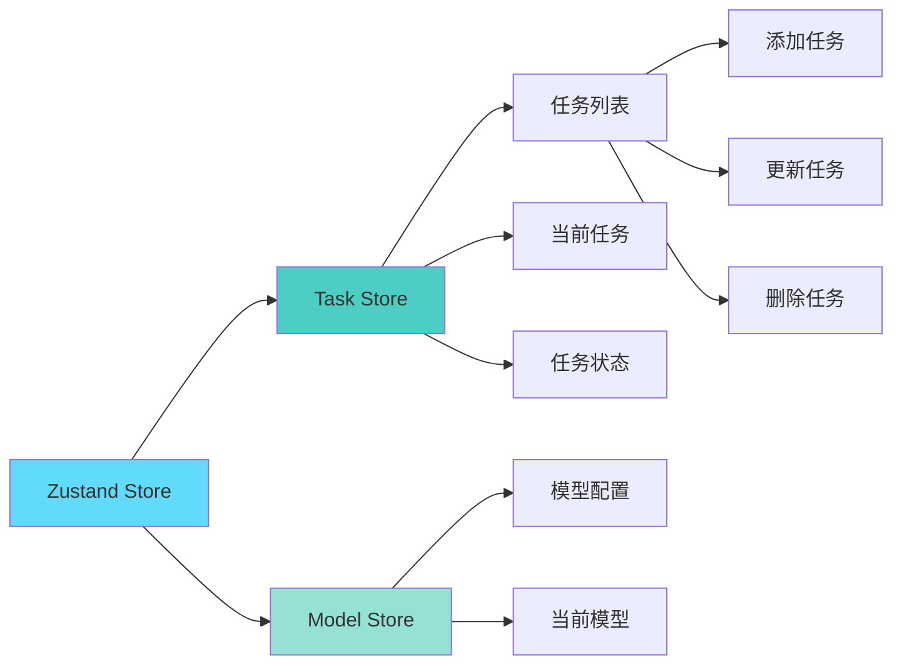

## 关键技术特性

### 1. 完全本地化处理

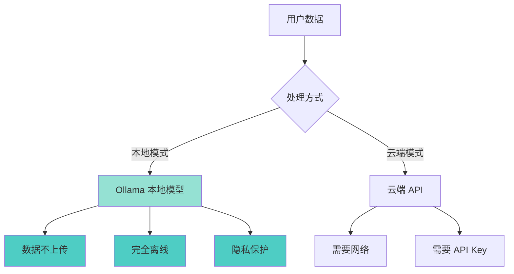

### 2. 缓存机制

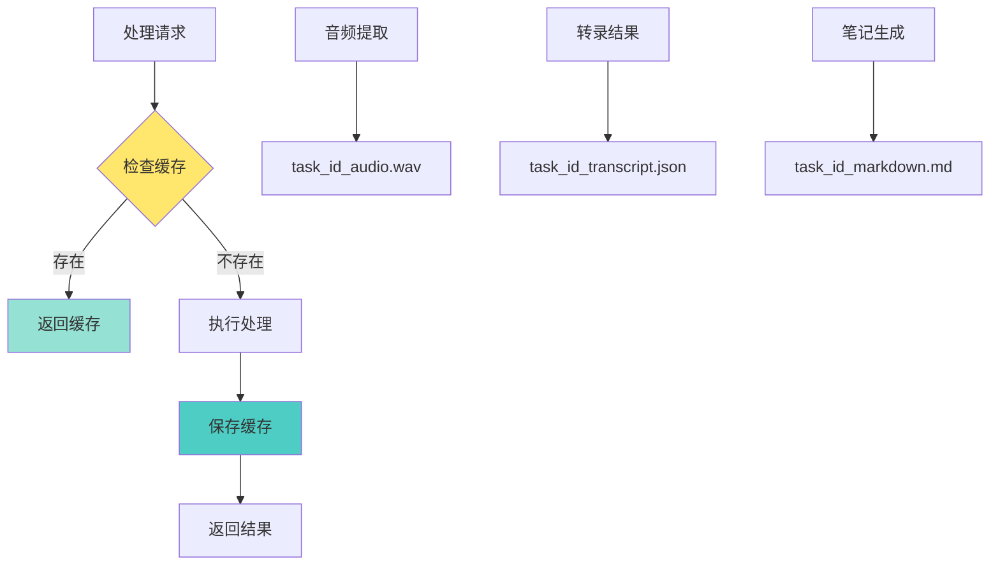

**缓存策略：**
- **音频文件**：提取后保存，避免重复提取
- **转录结果**：JSON 格式，包含完整分段信息
- **笔记内容**：Markdown 格式，支持增量更新（截图功能）

### 3. 分步执行设计

系统采用分步执行设计，用户可以控制每个步骤的执行时机：

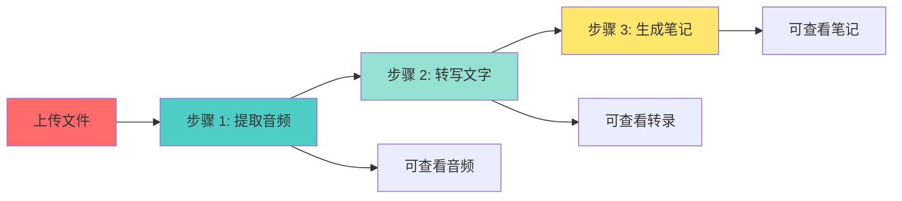

**优势：**
- 用户可以随时查看中间结果
- 支持单独重试某个步骤
- 降低单次处理失败的影响范围
- 提供更好的用户体验

## 性能优化

### 1. 模型加载优化

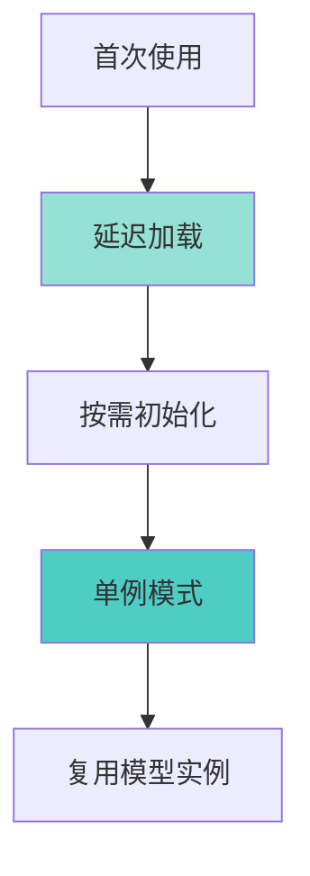

### 2. 异步处理

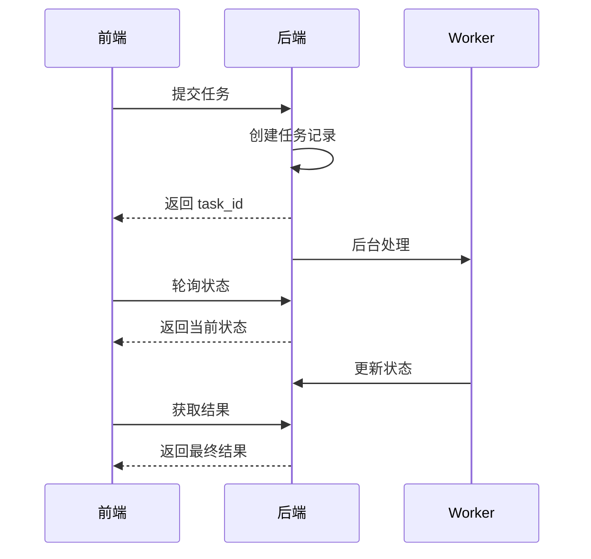

## 安全与隐私

### 数据隐私保护

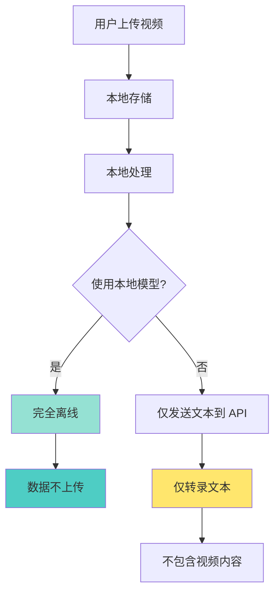

**隐私保护措施：**
1. 所有文件存储在本地文件系统
2. 支持完全离线运行（Ollama 模式）
3. 云端 API 仅传输文本，不传输视频/音频
4. 无数据收集和追踪

## 部署架构

### 开发环境

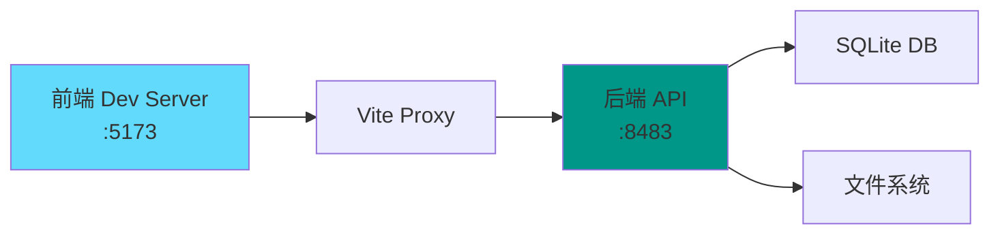

### 生产环境

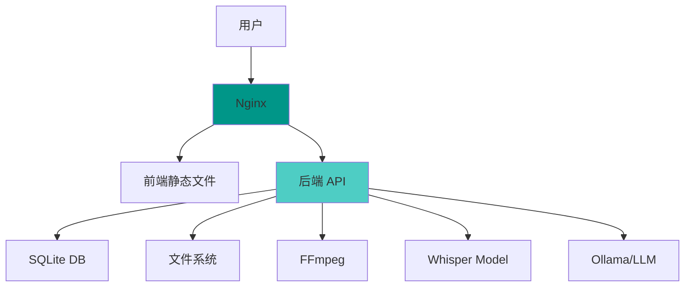

## 总结

Video AI Note 通过以下技术实现智能视频笔记生成：

1. **音频处理**：FFmpeg 提取和转换音频
2. **语音识别**：Fast-Whisper 实现快速准确的转录
3. **AI 生成**：大语言模型生成结构化笔记
4. **截图功能**：基于时间戳的智能截图插入
5. **本地化支持**：Ollama 实现完全离线运行
6. **缓存机制**：避免重复处理，提升性能
7. **分步执行**：提供灵活的用户控制

整个系统设计注重**隐私保护**、**用户体验**和**性能优化**，是一个功能完整、技术先进的视频笔记生成工具。

